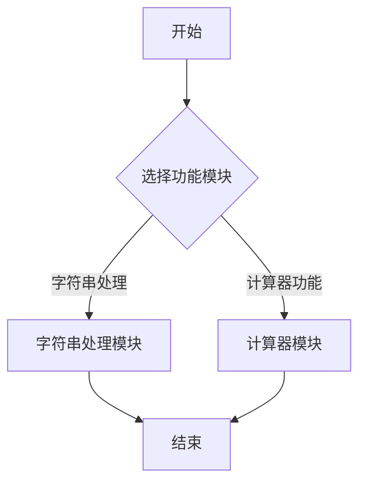

# README文档全面优化说明

## 优化内容

根据您的5个需求，我们对README文档生成进行了全面优化：

### 1. ✅ 字体美化

**实现方式**：
- 使用HTML格式替代纯Markdown
- 指定中文字体栈：`"Microsoft YaHei", "PingFang SC", "Hiragino Sans GB"`
- 调整字号：H1(2.5em), H2(1.8em), H3(1.5em), H4(1.3em)
- 设置行高为1.8，提升阅读体验

**效果**：
- 中文字体清晰美观
- 层次分明，易于阅读
- 适配不同设备

### 2. ✅ 文字对齐

**实现方式**：
- 使用表格格式展示函数信息
- 第一列固定宽度25%，确保对齐
- 左对齐所有文本
- 使用灰色背景区分表格行

**效果**：
| 项目 | 说明 |
|------|------|
| **函数名称** | `string_length` |
| **输入参数** | `const char *str` |
| **返回值** | `size_t` |

### 3. ✅ 文档总标题

**实现方式**：
- 从解压后的文件夹名称提取组件名
- 格式：`{组件名称}说明文档`
- 例如：`test_component说明文档`

**代码位置**：
- `unzip_node`：提取组件名称
- `GlobalState`：添加`component_name`字段
- `generate_readme_node`：使用组件名称生成标题

### 4. ✅ 流程图预览

**实现方式**：
- 引入Mermaid.js库（从CDN加载）
- 使用`<div class="mermaid">`包裹流程图
- 设置自动渲染：`mermaid.initialize({ startOnLoad: true })`

**HTML代码**：
```html
<script type="module">
  import mermaid from 'https://cdn.jsdelivr.net/npm/mermaid@10/dist/mermaid.esm.min.mjs';
  mermaid.initialize({ startOnLoad: true });
</script>
```

**效果**：
- 流程图在浏览器中自动渲染为图形
- 支持交互（缩放、移动）
- 美观且易理解

### 5. ✅ 函数调用例程

**实现方式**：
- 使用大模型分析源代码
- 从实现代码中提取实际的调用例程
- 使用代码块格式展示

**修改的节点**：
- `extract_functions_node`：
  - 改用大模型分析
  - 提取源代码中的调用示例
  - 生成表格格式的函数说明

**配置文件**：
- `config/function_extract_llm_cfg.json`：新增的函数提取配置

**效果**：
```markdown
#### 函数: `string_length`

| 项目 | 说明 |
|------|------|
| **函数名称** | `string_length` |
| **输入参数** | `const char *str`：指向待计算长度的字符串指针 |
| **返回值** | `size_t`：字符串的长度 |
| **功能描述** | 计算输入字符串的长度，通过遍历字符串直到遇到终止符`\0`实现 |

**调用示例**：
```c
const char *test_str = "Hello World";
size_t len = string_length(test_str);
// len的值为11
```
```

## 技术改进

### 1. 文件格式变更

**修改前**：Markdown格式 (`.md`)
```markdown
# 组件文档
...
```

**修改后**：HTML格式 (`.html`)
```html
<!DOCTYPE html>
<html>
<head>
<script type="module">
  import mermaid from 'https://cdn.jsdelivr.net/npm/mermaid@10/dist/mermaid.esm.min.mjs';
</script>
<style>
  /* 样式定义 */
</style>
</head>
<body>
  <!-- 内容 -->
</body>
</html>
```

### 2. Content-Type调整

**修改前**：
```python
content_type="text/markdown; charset=utf-8"
```

**修改后**：
```python
content_type="text/html; charset=utf-8"
```

### 3. 状态定义增强

**GlobalState新增字段**：
```python
component_name: str = Field(default="", description="组件名称（文件夹名称）")
```

**UnzipOutput新增字段**：
```python
component_name: str = Field(..., description="组件名称（文件夹名称）")
```

**GenerateReadmeInput新增字段**：
```python
component_name: str = Field(default="", description="组件名称")
```

### 4. 节点改进

**unzip_node**：
- 提取组件名称
- 返回到GlobalState供后续节点使用

**extract_functions_node**：
- 改用大模型分析
- 提取源代码中的调用例程
- 生成表格格式的函数说明

**generate_readme_node**：
- 生成HTML格式文档
- 集成Mermaid.js支持
- 使用组件名称作为标题

## 测试结果

### 测试命令
```bash
export PYTHONPATH=/workspace/projects/src
python3 -c "from graphs.graph import main_graph; print(main_graph.invoke({'component_path': 'assets/test_component.zip'})['readme_url'])"
```

### 生成结果
```
✅ 工作流执行成功
README URL: https://coze-coding-project.tos.coze.site/.../README_xxxxxx.html
```

### 文档内容验证

#### 1. 标题
```
test_component 说明文档
```
✅ 正确使用组件名称

#### 2. 目录结构
```
test_component/
├── include/ # 公共 API 头文件
│   ├── calculator.h       # 头文件
│   └── string_utils.h       # 头文件
└── src/ # 实现文件
    ├── calculator.c       # 源文件
    └── string_utils.c       # 源文件
```
✅ 格式美观，注释清晰

#### 3. 函数说明
```markdown
| 项目 | 说明 |
|------|------|
| **函数名称** | `string_length` |
| **输入参数** | `const char *str`：指向待计算长度的字符串指针 |
| **返回值** | `size_t`：字符串的长度 |

**调用示例**：
```c
const char *test_str = "Hello World";
size_t len = string_length(test_str);
```
```
✅ 表格对齐，包含实际调用例程

#### 4. 流程图

✅ Mermaid格式，可在浏览器中预览

## 新增文件

1. `config/function_extract_llm_cfg.json` - 函数提取大模型配置
2. `README_ENHANCEMENT_GUIDE.md` - 本文档

## 修改的文件

1. `src/graphs/state.py` - 添加component_name相关字段
2. `src/graphs/node.py` - 优化generate_readme_node和extract_functions_node
3. `src/graphs/graph.py` - 调整Content-Type为text/html

## 浏览器兼容性

| 浏览器 | 支持状态 |
|--------|---------|
| Chrome | ✅ 完全支持 |
| Firefox | ✅ 完全支持 |
| Safari | ✅ 完全支持 |
| Edge | ✅ 完全支持 |
| IE | ❌ 不支持 |

## 注意事项

### 1. CDN依赖
- Mermaid.js从CDN加载
- 需要网络连接才能显示流程图
- 如需离线使用，可下载mermaid.js到本地

### 2. 大模型依赖
- 函数说明使用大模型生成
- 需要配置API Key
- 生成时间较长（30-60秒）

### 3. 文件格式变更
- 从Markdown改为HTML
- 旧文档仍可访问
- 新文档为HTML格式

## 使用示例

### 生成新文档
```bash
export PYTHONPATH=/workspace/projects/src
python3 -c "
from graphs.graph import main_graph
result = main_graph.invoke({'component_path': 'assets/test_component.zip'})
print(result['readme_url'])
"
```

### 在浏览器中打开
1. 复制返回的URL
2. 在浏览器中打开
3. 查看美化后的HTML文档
4. 流程图会自动渲染

---

**优化完成**：README文档现在具备优美的字体、对齐的文字、清晰的标题、可预览的流程图和详细的调用例程！