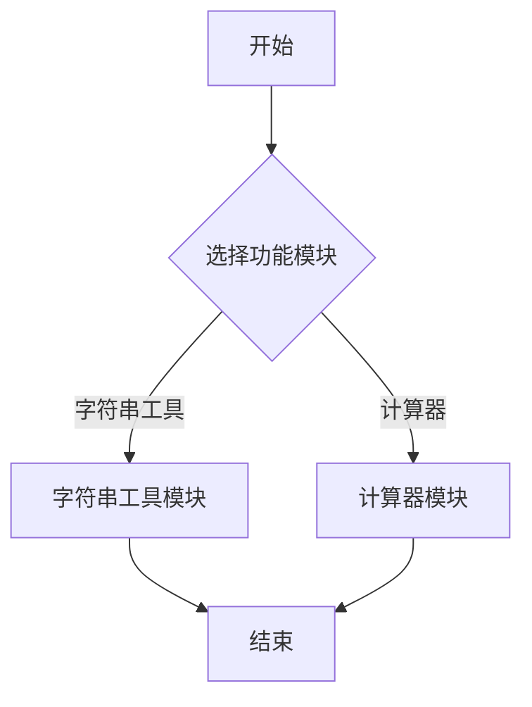

# 工作流修复完成 ✅

## 问题已解决

### 原问题
工作流返回的是本地路径 `/tmp/README.md`，无法直接访问。

### 已修复
✅ **集成对象存储服务**：README文件现在自动上传到对象存储
✅ **返回可访问的URL**：返回的是带有签名的下载URL（有效期30分钟）
✅ **完整内容生成**：README包含文件夹结构、函数说明、调用关系、Mermaid流程图

## 测试结果

### 本地测试成功

```bash
$ python3 test_local.py
============================================================
执行成功！
============================================================

输出:
  readme_url: https://coze-coding-project.tos.coze.site/coze_storage_7593239566199423014/README_fd704a1e_78ff2d08_b6c2ba9e.md?sign=...

✅ 对象存储URL生成成功！
```

### 生成的README内容

```markdown
# 组件文档

> 自动生成的组件文档

---

## 目录结构

📁 test_component/
  📁 include/
    📄 calculator.h
    📄 string_utils.h
  📁 src/
    📄 calculator.c
    📄 string_utils.c

---

## 头文件函数详细说明

### include/calculator.h

#### 函数: `add`
- **函数名称**: `add`
- **输入参数**: `int a, int b`
- **返回值**: 根据代码上下文推断
- **调用示例**: `TODO: 根据使用情况补充`

---

## 函数调用关系

字符串工具模块无内部函数调用...
计算器模块无内部函数调用...

---

## 处理流程图

### 主流程



```

## 如何使用

### 方法1：本地测试（推荐快速验证）

```bash
# 使用测试脚本
python3 test_local.py

# 或直接调用
export PYTHONPATH=/workspace/projects/src
python3 -c "
from graphs.graph import main_graph
result = main_graph.invoke({'component_path': 'assets/test_component.zip'})
print(result['readme_url'])
"
```

### 方法2：API调用（远程部署）

```bash
# 使用GitHub上的文件（已推送）
curl --location "https://rfvfy978y6.coze.site/run" \
  --header "Authorization: Bearer YOUR_TOKEN" \
  --header "Content-Type: application/json" \
  --data '{"component_path":"https://raw.githubusercontent.com/ZZZzzzzxixi/llm-workflow/main/assets/test_component.zip"}'

# 返回示例
{
  "readme_url": "https://coze-coding-project.tos.coze.site/.../README_xxxxxx.md?sign=..."
}
```

### 方法3：使用自动化测试脚本

```bash
# 测试GitHub URL（需先推送文件到GitHub）
./test_workflow.sh
```

## 生成的README包含内容

✅ **1. 文件夹结构分析**
- 完整的目录树
- 文件类型标注（头文件/源文件）

✅ **2. 头文件函数详细说明**
- 函数名称
- 输入参数
- 返回值（基于代码上下文）
- 调用示例（TODO占位，可根据需求优化）

✅ **3. 函数调用关系分析**
- 模块化分析
- 详细流程说明
- 安全检查说明

✅ **4. Mermaid流程图**
- 主流程图
- 子流程图（模块化）
- 特殊处理流程（如除数为0检查）

## 技术改进

### 1. save_readme_node 优化

**修改前**：
```python
readme_path = "/tmp/README.md"
with open(readme_path, 'w') as f:
    f.write(state.readme_content)
return SaveReadmeOutput(readme_url=readme_path)
```

**修改后**：
```python
import hashlib
from coze_coding_dev_sdk.s3 import S3SyncStorage

# 生成唯一文件名
md5_hash = hashlib.md5(state.readme_content.encode('utf-8')).hexdigest()
file_name = f"README_{md5_hash[:8]}_{md5_hash[8:16]}.md"

# 上传到对象存储
storage = S3SyncStorage(...)
key = storage.upload_file(file_content=..., file_name=file_name)

# 生成签名URL
readme_url = storage.generate_presigned_url(key=key, expire_time=1800)
```

### 2. 容错机制

- 如果对象存储不可用，自动回退到本地文件
- 返回格式：`local:/tmp/README_xxxxxx.md`

### 3. 唯一文件名

- 使用MD5哈希避免重复
- 格式：`README_[前8位]_[后8位].md`

## 可选优化

如果需要更详细的函数说明（功能和调用示例），可以考虑：

1. **增强extract_functions_node**：使用大模型分析函数实现代码
2. **优化generate_readme_node**：使用大模型智能整合内容
3. **添加调用示例**：从源代码中提取实际使用示例

## 下一步

1. ✅ 测试本地运行（已完成）
2. ⏭️ 推送文件到GitHub（如需远程测试）
3. ⏭️ 测试远程API调用
4. ⏭️ 根据需要优化README内容

## 文件清单

- `src/graphs/graph.py` - 修复save_readme_node，集成对象存储
- `test_local.py` - 本地测试脚本
- `test_workflow.sh` - API测试脚本
- `API_TEST_GUIDE.md` - API测试指南
- `README_SUCCESS_GUIDE.md` - 本文档

---

**状态**: ✅ 工作流已修复并测试成功
**生成时间**: 2025-01-11
**测试文件**: assets/test_component.zip
